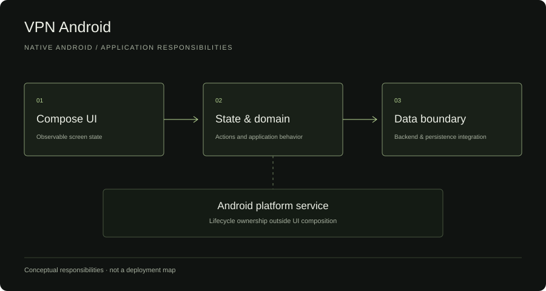

# Android Networking

An independent Kotlin/JVM example of observable UI state, coroutine lifecycle ownership, and startup reconciliation.

## Review in 30 seconds

The engineering question is how to keep cached or late results from becoming current UI truth. Read [the state holder](examples/ui-state/src/main/kotlin/example/state/ConnectionModel.kt), [sealed states](examples/ui-state/src/main/kotlin/example/state/ConnectionState.kt) and [the repository contract](examples/ui-state/src/main/kotlin/example/state/ConnectionRepository.kt). [Deterministic tests](examples/ui-state/src/test/kotlin/example/state/ConnectionModelTest.kt) and [latest verification](docs/verification.md) make the lifecycle assumptions reviewable.

## What this demonstrates

A sealed state model, read-only StateFlow, a repository boundary, cancellable operations, stale-result protection, and explicit worker shutdown. It extracts general architecture concerns from an Android application under active development. It contains no VPN runtime or Android dependency.

## Architecture



In the private application, Compose observes a ViewModel, repositories handle remote/persistence boundaries, and startup reconciliation checks current authority. In this public example, a platform-neutral ConnectionModel owns jobs and observable state. An Android ViewModel could own it and supply its UI dispatcher/lifecycle; this JVM class is deliberately not an AndroidX ViewModel subclass. Compose, DataStore, and VpnService are not implemented here.

## Code examples

Read [ConnectionModel.kt](examples/ui-state/src/main/kotlin/example/state/ConnectionModel.kt), [ConnectionState.kt](examples/ui-state/src/main/kotlin/example/state/ConnectionState.kt), and [ConnectionRepository.kt](examples/ui-state/src/main/kotlin/example/state/ConnectionRepository.kt). [Tests and fakes](examples/ui-state/src/test/kotlin/example/state/ConnectionModelTest.kt) run without an emulator or service.

The holder starts Loading, queries a synthetic authoritative preparation record, and transitions to Ready or Disconnected. Ready means preparation exists and has not expired. Only an explicit successful operation produces Connected. CachedHint represents persisted metadata and never establishes current connection state.

## Engineering decisions

All actions and callbacks are confined to one single-thread UI dispatcher. Each replacement operation cancels its predecessor and increments a revision; superseded or cancelled results cannot update state or cached hints. Expected repository failures become Unavailable; CancellationException is rethrown. StateFlow exposes the latest state and can conflate rapid updates; it is not an event log.

Cancellation has its own state because requesting cancellation does not prove an external connection stopped. Shutdown cancels and joins owned workers, after which actions are ignored. This example does not control a platform service. See [interview notes](docs/interview-notes.md) and [scope](docs/spec.md).

## Failure handling

Lookup failures are not replaced by cached success. Missing/expired preparation clears the hint. Duplicate connect clicks while an operation is pending are rejected. Cancelled work must unwind partial resources in its adapter. A faulty late result cannot overwrite newer intent. Expected failures must be translated at the repository boundary; unexpected programming defects are not disguised as ordinary unavailability.

## Tests

JDK 21, Gradle 8.13, Kotlin 2.2.21, and coroutines 1.10.2:

```sh
./gradlew --no-daemon test
```

On Windows use `gradlew.bat --no-daemon test`. The wrapper is generated from official Gradle tooling and pins the distribution SHA-256.

[GitHub Actions](https://github.com/lolpul/vpn-android-showcase/actions/workflows/kotlin.yml) runs JVM unit tests. Tests cover initial state, success/failure, cancellation cleanup, parent lifecycle cancellation, expiry, restart reconciliation, observed transition ordering, superseded requests, and shutdown. Coroutine test scheduling and fakes make these checks deterministic; no sleeps or network services are used.

## Limitations

This is a ViewModel-style state holder, not a complete Android application or real networking client. It does not validate Compose rendering, process death, device APIs, persistent storage, backend integration, or VPN connectivity. Callers must obey dispatcher confinement; it is not an arbitrary-thread concurrency API. Cancellation remains cooperative, and shutdown can wait for uncooperative work. The fake preparation and cached hint are distinct from any private session/schema. There is no app-store, production, device, throughput, or full-service claim.

## Relation to private project

Read-only source/test review confirmed observable state, repository isolation, owned coroutines, startup authority checks, stale-cache replacement, and restored metadata not being a running connection. A stale private scaffold-only README was corrected from tree evidence; private builds/device tests were not rerun for that documentation change.

This public module was independently written with new names, models, interfaces, and tests. No original file, endpoint, protocol, runtime configuration, auth flow, identifier, signing material, integration, or Git history was transferred. Prepared with AI assistance and reproducible host tests; no license to the private application is granted.

## Portfolio

[Case study](https://elisey.kochura.com/work/android-networking) | [Portfolio](https://elisey.kochura.com) | [GitHub profile](https://github.com/lolpul)
